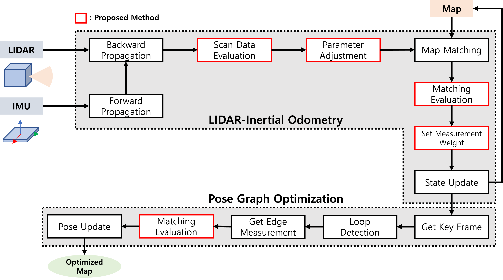
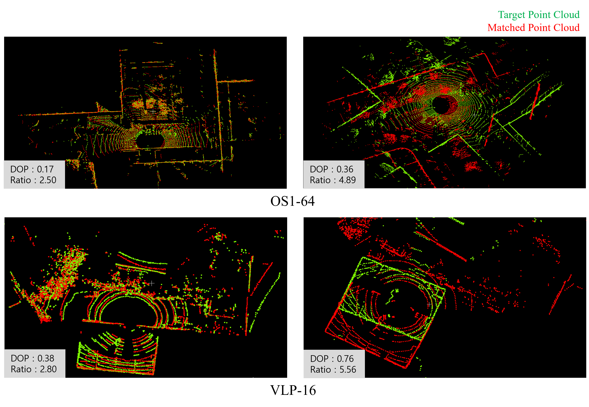

# FAST_LIO2 Mapping and Localization

A LiDAR-Inertial SLAM package based on FAST-LIO2, integrating a **DOP (Dilution of Precision)-based scan matching confidence evaluation** method for robust odometry and pose graph optimization. Two operation modes are supported: **Mapping** and **Localization**.

> **Base**: [FAST_LIO_ROS2 (Ericsii)](https://github.com/Ericsii/FAST_LIO_ROS2)  

<div align="center">

<p>LiDAR SLAM Pipe Line</p>


<p>Mapping</p>


<p>Localization</p>


</div>

---

## Key Features

- **Dual Operation Modes**: Two separate executables — `fastlio_mapping` (map building) and `fastlio_localization` (pose estimation against a pre-built map)
- **DOP-Based Scan Matching Confidence Evaluation**: Applies the DOP concept from GNSS to LiDAR scan matching. The raw PDOP is normalized by the sensor FOV geometry so that the resulting metric is scale-free (≈ 1 for ideal geometry, larger means worse)
  - **Scan DOP**: Evaluates the geometric distribution of the input scan and dynamically adjusts the voxel leaf size and the point-thinning stride
  - **Matching DOP**: Evaluates the geometric distribution of matched points and scales the IESKF measurement covariance
  - **DOP Ratio** (Localization only): `down_dop / matching_dop` — used both as the localization initialization criterion and as the trigger for on-line map augmentation
- **Pose Graph Optimization Integration**: `mapping.launch.py` launches the `pose_graph_optimization` node together with the SLAM node, and streams keyframes over `/key_frame`
- **Crop-Based Local Map Management (Localization)**: The prior `.pcd` map is kept as an immutable master cloud, and only an X-Y window around the robot is loaded into the ikd-Tree. The window is moved by incremental add/delete on a background thread, so the 20 ms control loop is never blocked
- **Map Point Count Cap (Mapping)**: In addition to the ikd-Tree sliding window, a hard cap (`mapping.max_map_points`) removes the oldest points once exceeded, bounding memory usage on long runs
- **Real-Time Analytics Topics**: `/lio_analytics` and `/loc_analytics` publish per-frame timing, matching quality, DOP, EKF covariance, and CPU/RAM usage for external monitoring (e.g. Web GUI)
- **Multi-LiDAR Support**: Livox (Avia, MID360, MID70), Velodyne, Ouster (32/64/128), Hesai32
- **Performance Statistics**: Both nodes print cumulative processing time statistics (point matching, KD-Tree, Jacobian, EKF update, total) to the console on `SIGINT`

---

## Algorithm Overview

### FAST-LIO2 Core Pipeline

FAST-LIO2 estimates robot pose using an Iterated Error State Kalman Filter (IESKF) that tightly couples IMU data with LiDAR point clouds.

1. **IMU Forward Propagation**: Predicts robot state using IMU measurements
2. **LiDAR Motion Undistortion**: Corrects scan distortion using IMU integration results
3. **Point Matching**: Scan-to-map point matching using ikd-Tree
4. **IESKF Update**: Updates state and covariance using matching residuals as observations

### DOP-Based Scan Matching Confidence Evaluation

The DOP concept from GNSS — which quantifies the geometric arrangement between satellites and the receiver — is applied to LiDAR scan matching.

**Step 1 — PDOP Computation**

The input cloud is first downsampled with a 2.5 m voxel grid so that the DOP reflects geometry rather than point density. Points closer than `preprocess.blind` are discarded. For each remaining point $i$:

$$r_i = \sqrt{(x_i - x_s)^2 + (y_i - y_s)^2 + (z_i - z_s)^2}$$

Unit vector matrix:

$$A = \begin{bmatrix} \frac{x_1 - x_s}{r_1} & \frac{y_1 - y_s}{r_1} & \frac{z_1 - z_s}{r_1} \\ \vdots & \vdots & \vdots \\ \frac{x_n - x_s}{r_n} & \frac{y_n - y_s}{r_n} & \frac{z_n - z_s}{r_n} \end{bmatrix}$$

Covariance matrix and PDOP:

$$Q = (A^T A)^{-1}, \quad \text{PDOP} = \sqrt{\text{tr}(Q)}$$

PDOP is clamped to 100.0 when the matrix is singular, non-finite, or the result exceeds that bound.

**Step 2 — Normalization by FOV Geometry**

A raw PDOP shrinks as $1/\sqrt{n}$ simply because more points were observed, which makes it useless as an absolute quality metric. It is therefore divided by the PDOP that an *ideal* sensor with the same vertical FOV $\theta_v$ (`fov_u`) and the same voxel size would produce:

$$u_z = \frac{1}{2} - \frac{\sin 2\theta_v}{4\theta_v}, \qquad g_{\text{floor}} = \sqrt{\frac{4}{1 - u_z} + \frac{1}{u_z}}$$

$$R_{\text{eff}}^2 = R_{\text{mean}}^2 - R_{\text{blind}}^2, \qquad n_{\text{typ}} = \frac{4\pi \sin\theta_v \cdot R_{\text{eff}}^2}{d_{\text{voxel}}^2}$$

$$\rho = \text{PDOP} \cdot \frac{\sqrt{n_{\text{typ}}}}{g_{\text{floor}}}$$

with $R_{\text{mean}} = 10.0\ \text{m}$ and $d_{\text{voxel}} = 2.5\ \text{m}$. The normalized value $\rho$ is what the code calls `scan_dop` / `down_dop` / `matching_dop`: it is close to 1 for well-conditioned geometry and grows in degenerate environments such as narrow corridors or staircases.

**Step 3 — Measurement Covariance Scaling**

The normalized matching DOP is applied directly as a linear scale on the LiDAR measurement covariance:

$$R = \rho_{\text{match}} \cdot \sigma_L^2, \qquad \sigma_L^2 = 0.001$$

When `dop_flag` is `false`, the covariance stays fixed at $\sigma_L^2$.

**Step 4 — Adaptive Downsampling**

The scan DOP scales both the voxel leaf size and the pre-scan point stride, so that poor geometry keeps more points. With the scale factor

$$s = \frac{1}{\rho_{\text{scan}}}$$

the two adaptive parameters become:

- `filter_size_surf_ad` = clamp(*s* × `filter_size_surf`, 0.05, 1.0)
- `point_filter_num_ad` = clamp(*s* × `point_filter_num`, 1, `scan_line` / 2)

**DOP Usage Summary**

| Metric | Input point set | Usage |
|--------|-----------------|-------|
| `scan_dop` | Undistorted full scan (`feats_undistort`) | Adaptive voxel leaf size and point stride |
| `down_dop` | Downsampled scan (`feats_down_body`) | Reference for `dop_ratio` (Localization only) |
| `matching_dop` | Points actually matched in the IESKF update | Measurement covariance scaling (`lidar_meas_cov`) |
| `dop_ratio` | `down_dop / matching_dop` | Initialization / map augmentation trigger (Localization only) |



### Localization Health Monitoring via DOP Ratio

`dop_ratio` expresses how much of the observable scan geometry was actually explained by the prior map. It drives two decisions in Localization mode:

| Condition | Behavior |
|-----------|----------|
| `dop_ratio >= 0.8` while not yet initialized | Localization is declared initialized (`Position is Initialized.`); before that the EKF update is rejected and velocity is zeroed |
| `dop_ratio < 0.6` after initialization | The current scan is merged into the live local map (`map_incremental` + merge into the cropped map), covering regions missing from the prior map |

---

## Map Management

### Mapping Mode — ikd-Tree Sliding Window + Point Cap

- A local map cube of side `cube_side_length` follows the robot. When the sensor comes within `1.5 × det_range` of a cube face, the cube is shifted and the out-of-range boxes are removed with `Delete_Point_Boxes`.
- Independently, `trim_map_by_count()` checks `ikdtree.validnum()` every frame. Once it exceeds `mapping.max_map_points` (default 200,000), the oldest points — ordered by their insertion timestamp stored in the `curvature` field — are deleted down to 95% of the cap.

### Localization Mode — Crop-Based Local Map

- `map_file_path` is loaded once, downsampled at `filter_size_map`, and kept in `laserCloudMap` as an immutable master cloud. The node shuts down if the file cannot be opened.
- Only an X-Y window of width `localization.map_crop_xy_range` (Z unbounded) around the current pose is held in the ikd-Tree.
- When the robot moves more than `localization.keyframe_threshold` from the last window center, a background thread computes the exact leaving rectangles, deletes them, and adds only the newly entered points. The ikd-Tree is **not** rebuilt during normal driving.
- A full `ikdtree.Build()` happens only twice: at the very first window, and whenever a new `/initialpose` makes the pose jump.
- A 2D voxel occupancy hash (at `filter_size_map` resolution) prevents re-adding points that the tree already holds.

---

## ROS 2 Interfaces

### Mapping Node (`fastlio_mapping`)

| Direction | Topic | Type |
|-----------|-------|------|
| Sub | `common.lid_topic` | `sensor_msgs/PointCloud2` or `livox_ros_driver2/CustomMsg` (Livox) |
| Sub | `common.imu_topic` | `sensor_msgs/Imu` |
| Pub | `/Odometry` | `nav_msgs/Odometry` |
| Pub | `/path` | `nav_msgs/Path` |
| Pub | `/cloud_registered` | `sensor_msgs/PointCloud2` (world frame) |
| Pub | `/cloud_registered_body` | `sensor_msgs/PointCloud2` (body frame) |
| Pub | `/cloud_effected` | `sensor_msgs/PointCloud2` (matched features) |
| Pub | `/key_frame` | `fast_lio/Frame` → `pose_graph_optimization` |
| Pub | `/lio_analytics` | `fast_lio/LioAnalytics` |
| TF | `odom` → `base_link` | — |

The main loop runs on a 10 ms timer. A keyframe is emitted whenever the traveled distance since the last keyframe exceeds `mapping.keyframe_threshold`.

### Localization Node (`fastlio_localization`)

| Direction | Topic | Type |
|-----------|-------|------|
| Sub | `common.lid_topic` | `sensor_msgs/PointCloud2` or `livox_ros_driver2/CustomMsg` (Livox) |
| Sub | `common.imu_topic` | `sensor_msgs/Imu` |
| Sub | `/initialpose` | `geometry_msgs/PoseWithCovarianceStamped` (RViz *2D Pose Estimate*) |
| Sub | `common.odom_topic` | `nav_msgs/Odometry` (wheel odometry) |
| Sub | `/tf_static` | `tf2_msgs/TFMessage` |
| Pub | `/Odometry` | `nav_msgs/Odometry` |
| Pub | `/path` | `nav_msgs/Path` |
| Pub | `/cloud_registered` | `sensor_msgs/PointCloud2` (world frame) |
| Pub | `/cloud_registered_body` | `sensor_msgs/PointCloud2` (body frame, published only after initialization) |
| Pub | `/cloud_effected` | `sensor_msgs/PointCloud2` (matched features) |
| Pub | `/Laser_map` | `sensor_msgs/PointCloud2` (current cropped local map) |
| Pub | `/key_frame` | `fast_lio/Frame` |
| Pub | `/loc_analytics` | `fast_lio/LocAnalytics` |
| TF | `odom` → `base_link` | — |

The main loop runs on a 20 ms timer. The initial pose is set by publishing to `/initialpose`; no ICP/NDT pre-alignment is performed — the pose is written straight into the EKF state and the local map is rebuilt around it. **The robot must be stationary**: the request is rejected (`Cannot init Position.`) if the wheel odometry reports linear velocity above 0.01 m/s or angular velocity above 0.5°/s.

### Real-Time Analytics

`LioAnalytics.msg` and `LocAnalytics.msg` are published once per processed scan and carry, among others:

- Sensor rates, buffer backlogs, scan/downsample/map point counts
- Adaptive filter parameters (`filter_size_surf_ad`, `point_filter_num_ad`)
- Matching statistics (`num_feats`, `match_ratio`, residual mean/std)
- EKF covariance traces and `lidar_meas_cov`
- DOP metrics (`scan_dop`, `matching_dop`, plus `down_dop` / `dop_ratio` in Localization)
- Per-frame and cumulative (mean/max) timing for IMU, state update, and map update
- Trajectory distance, RSS memory in MB (`/proc/self/status`), and core-normalized CPU usage in %
- Localization only: `is_initialized`, `map_updated`, and the wheel odometry velocities

---

## Prerequisites

### 1. Ubuntu & ROS2

- **Ubuntu >= 20.04** (Recommended: Ubuntu 22.04)
- **ROS >= Foxy** (Recommended: ROS Humble)
  - [ROS Humble Installation](https://docs.ros.org/en/humble/Installation.html)

### 2. PCL & Eigen

```bash
sudo apt install libpcl-dev libeigen3-dev
```

- PCL >= 1.8
- Eigen >= 3.3.4

### 3. livox_ros_driver2

Required when using Livox series LiDAR:

```bash
git clone https://github.com/Livox-SDK/livox_ros_driver2.git
cd livox_ros_driver2
./build.sh humble
```

Add to `~/.bashrc`:

```bash
source ~/ws_livox/install/setup.bash
```

### 4. Dependencies (Mapping Mode)

`mapping.launch.py` launches the `pose_graph_optimization` node, so the package must be present in the same workspace:

```bash
cd <ros2_ws>/src
git clone https://github.com/Kimkyuwon/Pose_Graph_Optimization.git
```

### 5. Optional — octomap_server (Localization Mode)

`localization.launch.py` contains a ready-to-use `octomap_server` node definition and `localization_config.yaml` carries an `octomap:` parameter block, but the node is **commented out by default**. Install the package and uncomment `ld.add_action(octomap_server_node)` if you want an occupancy grid built from `/cloud_registered_body`:

```bash
sudo apt install ros-humble-octomap-server
```

---

## Build

```bash
cd <ros2_ws>/src
git clone https://github.com/Kimkyuwon/fast_lio2_mapping_and_localization.git --recursive fast_lio
cd ..
rosdep install --from-paths src --ignore-src -y
colcon build --symlink-install --packages-select fast_lio
source install/setup.bash
```

> **Note**: When using Livox LiDAR, make sure `livox_ros_driver2` is sourced before building.

---

## Usage

### Mapping Mode

```bash
ros2 launch fast_lio mapping.launch.py config_file:=mapping_config.yaml
```

Launches `fastlio_mapping` together with `pose_graph_optimization`. The RViz node is defined but commented out — launch RViz separately, or use the Web GUI:

```bash
ros2 run rviz2 rviz2 -d $(ros2 pkg prefix fast_lio)/share/fast_lio/rviz/fastlio.rviz
```

Change `config_file` according to your LiDAR:

| LiDAR | Config File | `lidar_type` |
|-------|-------------|--------------|
| Ouster 32 (default) | `mapping_config.yaml` | 3 |
| Ouster 64 | `ouster64.yaml` | 3 |
| Ouster 128 | `ouster128.yaml` | 3 |
| Velodyne 16 | `velodyne.yaml` | 2 |
| Hesai Pandar 32 | `hesai32.yaml` | 4 |
| Livox Avia | `avia.yaml` | 1 |
| Livox MID360 | `mid360.yaml` | 1 |
| Livox MID70 | `mid70.yaml` | 1 |

> `config/ouster32.yaml` is a legacy file kept for reference; it lacks the `/**: ros__parameters:` wrapper and will not load under ROS 2. Use `mapping_config.yaml` instead.

**Launch the LiDAR driver separately when using real hardware**:

```bash
# MID360 example
ros2 launch livox_ros_driver2 msg_MID360_launch.py
```

### Localization Mode

```bash
ros2 launch fast_lio localization.launch.py config_file:=localization_config.yaml
```

Localization config files, one per sensor, differ from the mapping ones mainly in `map_file_path` and the `localization:` block:

| Config File | `lidar_type` | Bundled `map_file_path` |
|-------------|--------------|-------------------------|
| `localization_config.yaml` (default) | 3 (Ouster 32) | `Map/b2.pcd` |
| `ouster32_localization.yaml` | 3 (Ouster 32) | `Map/map1.pcd` |
| `velodyne_localization.yaml` | 2 (Velodyne 16) | `Map/gsic_map.pcd` |
| `hesai32_localization.yaml` | 3 (Hilti / Hesai 32 via the Ouster handler) | `Map/hilti.pcd` |
| `mid360_localization.yaml` | 1 (Livox MID360) | `Map/g1Map.pcd` |

Steps:

1. Set `map_file_path` to the pre-built `.pcd` map. The path is resolved against `ROOT_DIR`, i.e. the package source directory, e.g. `"Map/b2.pcd"`.
2. Launch the node, then publish an initial pose with RViz **2D Pose Estimate** (`/initialpose`) while the robot is stationary.
3. Drive slowly until `Position is Initialized.` appears — this happens once `dop_ratio` reaches 0.8.

### Key Parameters

| Parameter | Mode | Default | Description |
|-----------|------|---------|-------------|
| `filter_size_surf` | both | 0.5 | Base voxel leaf size for scan downsampling (scaled by scan DOP) |
| `filter_size_map` | both | 0.5 | ikd-Tree / map voxel resolution |
| `point_filter_num` | both | 2 | Base point stride (scaled by scan DOP) |
| `max_iteration` | both | 4 | Maximum IESKF iterations per frame |
| `cube_side_length` | both | 200.0 | ikd-Tree local map cube side length (m) |
| `mapping.det_range` | mapping | 300.0 | LiDAR effective detection range (m) |
| `mapping.max_map_points` | mapping | 200000 | Hard cap on map points; oldest points are trimmed above this |
| `mapping.keyframe_threshold` | mapping | 0.5 | Travel distance between keyframes (m) |
| `mapping.dop_flag` | mapping | false | Enable DOP-based adaptive filtering and covariance scaling |
| `posegraph.fov_u` | mapping | 15.0 | Vertical FOV (deg) used for DOP normalization |
| `map_file_path` | localization | `""` | Prior `.pcd` map path, relative to the package source directory |
| `localization.map_crop_xy_range` | localization | 50.0 | Width of the X-Y local map crop window (m) |
| `localization.det_range` | localization | 300.0 | LiDAR effective detection range (m) |
| `localization.keyframe_threshold` | localization | 0.5 | Travel distance that triggers a crop window update (m) |
| `localization.dop_flag` | localization | false | Enable DOP-based adaptive filtering, initialization, and map augmentation |
| `localization.fov_u` | localization | 15.0 | Vertical FOV (deg) used for DOP normalization |
| `common.odom_topic` | localization | `/scout_base_controller/odom` | Wheel odometry topic used to gate `/initialpose` |
| `mapping/localization.extrinsic_T`, `extrinsic_R` | both | identity | LiDAR-to-IMU extrinsics |

---

## Performance (DOP Method Results)

The DOP-based scan matching confidence evaluation was validated on the following datasets.

### Hilti SLAM Challenge 2022 (ATE, m)

| Method | exp-06 RMSE | exp-14 RMSE | exp-16 RMSE | exp-18 RMSE |
|--------|------------|------------|------------|------------|
| FAST-LIO2 | 0.039 | 0.058 | div. | 1.452 |
| Faster-LIO | 0.070 | 0.090 | div. | 4.000 |
| **Proposed** | **0.045** | 0.077 | **0.636** | **0.156** |

> exp-16 and exp-18 include narrow staircase segments where existing methods diverge. The proposed DOP method maintains stable estimation throughout.

### VBR SLAM Dataset (ATE, m)

| Method | Colosseum RMSE | Diag RMSE |
|--------|---------------|----------|
| Faster-LIO | 2.730 | 0.217 |
| Faster-LIO + PGO | 0.386 | 0.179 |
| **Proposed (DOP + PGO)** | **0.250** | **0.165** |

---

## Related Papers

```bibtex
@article{xu2022fastlio2,
  title     = {FAST-LIO2: Fast Direct LiDAR-Inertial Odometry},
  author    = {Xu, Wei and Cai, Yixi and He, Dongjiao and Lin, Jiarong and Zhang, Fu},
  journal   = {IEEE Transactions on Robotics},
  volume    = {38},
  number    = {4},
  pages     = {2053--2073},
  year      = {2022}
}
```

```bibtex
@article{kim2025dop,
  title   = {Scan Matching Confidence Evaluation for Robust LiDAR Odometry and Pose Graph Optimization},
  author  = {Kim, Kyu-Won},
  journal = {Journal of Institute of Control, Robotics and Systems},
  volume  = {31},
  number  = {11},
  pages   = {1299--1306},
  year    = {2025},
  doi     = {10.5302/J.ICROS.2025.25.0088}
}
```

---

## Related Projects

- [Pose-Graph-Optimization](https://github.com/Kimkyuwon/Pose_Graph_Optimization): LiDAR-based pose graph optimization backend with loop closure detection and dynamic object removal
- [Long-Term-Mapping](https://github.com/Kimkyuwon/long_term_mapping): Multi-session LiDAR SLAM for long-term map maintenance with structural change detection
- [SLAM-WebGUI](https://github.com/Kimkyuwon/ROS-SLAM-WebUI): Web-based GUI integrating SLAM, localization, and real-time visualization into a single browser interface — consumes `/lio_analytics` and `/loc_analytics` for live monitoring

---

## Acknowledgments

- [FAST-LIO2 (HKU-MARS)](https://github.com/hku-mars/FAST_LIO): Core LiDAR-Inertial Odometry algorithm
- [FAST_LIO_ROS2 (Ericsii)](https://github.com/Ericsii/FAST_LIO_ROS2): ROS2 porting base code
- [LOAM](https://github.com/laboshinl/loam_velodyne): Original LiDAR Odometry algorithm (Ji Zhang, Carnegie Mellon University)
- [Livox_Mapping](https://github.com/Livox-SDK/livox_mapping), [LINS](https://github.com/ChaoqinRobotics/LINS---LiDAR-inertial-SLAM)

---

## License

BSD License
